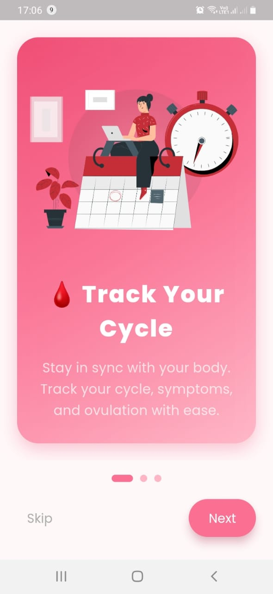
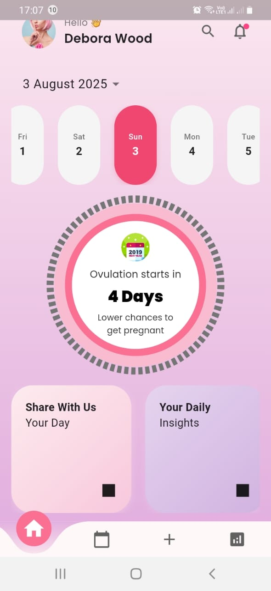

# 🌸 MyFlowMate – Menstrual Cycle & Wellness Tracker

MyFlowMate is a beautifully designed menstrual health app built with Flutter. It empowers users to track their cycle, understand their ovulation patterns, and gain daily insights for better reproductive health.

<p align="center">
  
</p>

---

## ✨ Features

- 🩸 **Cycle Tracking** – Easily select dates and follow your menstrual cycle.
- 🌼 **Ovulation Insights** – Visual representation of ovulation period with helpful tips.
- 📆 **Daily Reminders & Insights** – Get personalized tips and mood tracking support.
- 🎨 **Elegant UI** – Gradient design and animations that offer a soft, calming experience.
- 📱 **Responsive Layout** – Built with best practices for mobile platforms using Flutter.

---

## 🎨 UI Inspiration

> This project follows [this design inspiration on Dribbble](https://dribbble.com/shots/26182533-Period-Tracker-App-Design-Empowering-You-with-Insights) for its calming and empowering aesthetic, tailored for period tracking apps.

---

## 🛠️ Tech Stack

| Tech                   | Use                                     |
|------------------------|------------------------------------------|
| **Flutter**            | Mobile UI framework                     |
| **Dart**               | Programming language                    |
| **Google Fonts**       | Custom font integration                 |
| **easy_date_timeline** | Smooth horizontal date timeline widget |
| **Curved Navigation Bar** | Custom bottom navigation             |
| **Lottie** *(optional)*| Animated illustrations                 |

---

## 📁 Project Structure

lib/
├── main.dart
├── utils/
│ └── colors.dart
├── widgets/
│ ├── my_appbar.dart
│ ├── greeting_card.dart
│ ├── horizontal_date.dart
│ ├── ovulation_circle_avatar.dart
│ └── daily_insight.dart
└── screens/
└── home_screen.dart


---

## 📸 Screenshots


| On-boarding Screen 1 | On-boarding Screen 2 | Home Screen |
|-------------|-------------------|----------------|
|  |  |  |


---

## 🧪 How to Run

1. **Clone the project**

```bash
git clone https://github.com/yourusername/myflowmate.git
cd myflowmate


flutter pub get

